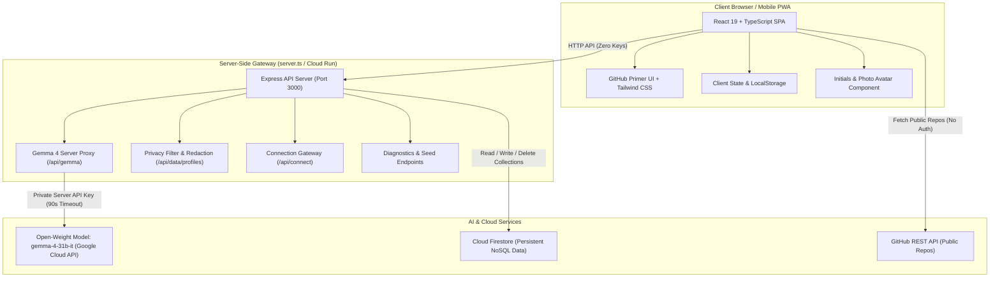

# System Architecture

This document describes the architectural design, security boundaries, and data flows of **Kwegatta**, an open-source student matchmaking platform aligned with the **Digital Public Goods Standard**.

---

## 1. High-Level Architecture Diagram

---

## 2. Component Layers

### A. Frontend Layer (React 19 SPA)
* **Framework**: React 19 with TypeScript, bundled with Vite.
* **Design System**: Exact GitHub Primer styling (Primer hex palette, system sans fonts, 6px border radius, subtle card headers, orange active tab indicators, and dark/light mode toggle).
* **Responsive Layout**: Designed mobile-first for small smartphone displays (< 380px) through tablet and auditorium projector views (`/wall`).
* **Zero Browser Secrets**: No API keys or cloud credentials exist anywhere in client-side code.

### B. Server-Side Gateway (`server.ts`)
* **Environment**: Node.js 20+ running Express.
* **Gemma 4 Proxy (`POST /api/gemma`)**:
  * Enforces the hard rule: Only the designated open-weight model `gemma-4-31b-it` can be invoked.
  * Injects the server-side `GEMINI_API_KEY` securely.
  * Configures `thinkingConfig: { thinkingLevel: 'MINIMAL' }` to reduce unnecessary reasoning token overhead and deliver fast responses.
  * Implements a 90-second timeout with automatic single retry on 500/timeout before activating keyword heuristics.
* **Privacy Layer (`GET /api/data/profiles`)**:
  * Redacts WhatsApp phone numbers from public member list queries to prevent automated scraping.
  * Returns numbers only to the authenticated owner or when an intentional connection is made.
* **Connection Gateway (`POST /api/connect`)**:
  * Handles explicit connection requests, logs target notifications, and safely returns protected communication channels.
* **Data Layer (`/api/data/:collection`)**:
  * CRUD endpoints interfacing with Cloud Firestore and local persistence.

### C. Foundation Model (`gemma-4-31b-it`)
* **Type**: Open-weight foundation model published under the Apache 2.0 license.
* **Hosting**: Google Cloud Generative Language API (`v1beta`).
* **Licence**: [Gemma License (Apache 2.0)](https://ai.google.dev/gemma/docs/core).
* **Guarantees**: Closed models (Gemini, GPT) are strictly banned from the codebase.

---

## 3. Data Flow & Security Boundaries

### User Onboarding Flow
1. Member answers conversational questions one by one.
2. If GitHub username is supplied, client queries GitHub REST API for public repositories and top languages.
3. Client sends factual profile data to `POST /api/gemma`.
4. Gemma 4 synthesizes a headline, first-person bio, tags, and role, adhering strictly to member-provided facts without inventing skills.
5. Member reviews the draft with options to approve or refine with natural language instructions.
6. Approved profile is stored in Cloud Firestore.

### Complementary Matchmaking Flow
1. Member views matches tab.
2. System pre-filters candidates (up to 30 active members in the room).
3. Payload is sent to `POST /api/gemma` with prompt prioritizing complementary offers over similar needs.
4. If Gemma 4 succeeds within 90s, structured top 3 matches are displayed with compatibility score, spark idea, and icebreaker.
5. If Gemma 4 fails or times out, the client automatically executes the pure keyword heuristic fallback algorithm (`calculateHeuristicScore` & `createFallbackMatch`), cleanly labeled as `Basic match (AI unavailable)`.

---

## 4. Resilience & Fallback Matrix

| Scenario | System Behavior | User Impact |
| -------- | --------------- | ----------- |
| Upstream Gemma 4 API returns 500 | Server retries once after 1s; if still failing, returns error with message | App immediately switches to keyword match fallback with clear label |
| Model inference takes > 90 seconds | Server aborts cleanly with timeout message | Fallback activates; no hanging requests |
| Client offline / poor Wi-Fi | LocalStorage cache serves previously ranked matches and local profile | Uninterrupted networking during spotty hackathon connectivity |
| GitHub API rate limited | Onboarding skips repo inspection gracefully | Member completes profile without delay |
