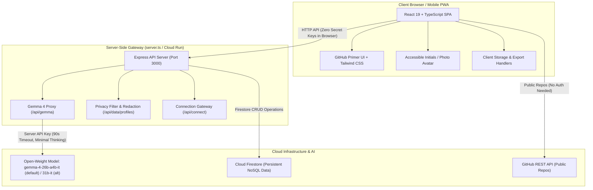

# Kwegatta 🤝

[](https://hacktoberfest.com/)
[](https://github.com/Saifuddin2Ahmed/kwegatta)
[](https://www.mlh.com/opensource-ai)
[_|_31b--it-4493f8.svg?style=flat-square)](https://ai.google.dev/gemma/docs/core)
[](./LICENSE)
[](https://ai.google.dev/gemma/docs/core)
[](./docs/DPG-ALIGNMENT.md)
[](https://primer.style/)

> **"Find the people you should build and learn with."**  
> Kwegatta comes from the Luganda word okwegatta, meaning to unite or come together. As the saying goes, Okwegatta ge maanyi: unity is strength. Built for **Hacktoberfest 2026 Hack Day Kampala x MUBS** (Makerere University Business School) where it was named one of the two winning teams (2nd place).

* **Live Application**: [https://kwegatta.ai.studio](https://kwegatta.ai.studio)
* **GitHub Repository**: [https://github.com/Saifuddin2Ahmed/kwegatta](https://github.com/Saifuddin2Ahmed/kwegatta)
* **Digital Public Goods Standard**: Designed and documented to be **aligned with** the Digital Public Goods Standard ([docs/DPG-ALIGNMENT.md](docs/DPG-ALIGNMENT.md)).

---

## Table of Contents

- [The Problem](#the-problem)
- [The Solution & Goals](#the-solution--goals)
- [Hackathon Context & Challenge](#hackathon-context--challenge)
- [How We Meet the Challenge Requirements](#how-we-meet-the-challenge-requirements)
- [Team](#team)
- [System Architecture](#system-architecture)
- [Core Features](#core-features)
- [Open-Weight AI Model (Gemma 4: gemma-4-26b-a4b-it / gemma-4-31b-it)](#open-weight-ai-model-gemma-4)
- [Privacy & User Sovereignty Controls](#privacy--user-sovereignty-controls)
- [Tech Stack](#tech-stack)
- [Run Locally](#run-locally)
- [Deployment (Google Cloud Run)](#deployment-google-cloud-run)
- [Acknowledgements](#acknowledgements)
- [License](#license)

---

## The Problem

At **Hacktoberfest Hack Day Kampala x MUBS**, business students with promising venture ideas and software engineers with technical chops sit in the exact same room and never find each other.

The same disconnect occurs with learning: a developer eager to master Flutter or an accounting student wanting to understand database APIs often sits two desks away from someone who could teach it effortlessly.

Traditional networking fails because:
* People talk only to friends they arrived with.
* Traditional social networks prioritize vanity metrics over complementary need/offer pairing.
* Hackathon signups are too lengthy and complex for mobile devices during a live event.

---

## The Solution & Goals

**Kwegatta** turns room networking into a seamless experience:
1. **Chat Onboarding on Mobile**: A quick conversation gathers the member's name, public GitHub, what they offer, what they need, what they teach, and what they want to learn.
2. **AI Synthesized Profiles**: The open-weight model **Gemma 4** (`gemma-4-26b-a4b-it` default, `gemma-4-31b-it` alternative) synthesizes a punchy headline, 2-sentence bio, skills, and role using strictly member-supplied facts.
3. **Complementary Matchmaking**: AI evaluates need-and-offer coverage rather than mere surface similarity (e.g., matching a business student who needs mobile developers with a Flutter developer who needs sales and marketing).
4. **Instant WhatsApp / LinkedIn Connect**: With one tap, users launch a pre-composed WhatsApp icebreaker (`wa.me`) or reach out via LinkedIn.
5. **Peer Mentorship & Study Buddies**: Automatically identifies one mentor (who teaches what you want to learn) and one study partner (learning the same topic).
6. **Projector Live Wall (`/wall`)**: A live wall for projectors showing real-time member registrations, AI pairings, trending skills, and a giant join QR code.

---

## Hackathon Context & Challenge

* **Event**: Hacktoberfest 2026 Hack Day Kampala x MUBS, Friday 2 October 2026
* **Venue**: Entrepreneurship, Innovation and Incubation Centre (EIIC), Makerere University Business School (MUBS), Nakawa Campus, Kampala, Uganda
* **Hosts**: Web3 Club MUBS and GDG on Campus MUBS
* **Organizers**: Hacktoberfest 2026 is powered by **Major League Hacking (MLH)** and **DEV**, presented by **DigitalOcean**. Theme: *"AI belongs to everyone"*.
* **Challenge Entered**: **Best Open-Source AI Project** ([https://www.mlh.com/opensource-ai](https://www.mlh.com/opensource-ai))
* **Result**: Named one of the two winning teams (**2nd place · Hacktoberfest 2026 Hack Day Kampala**).
* **Designated Models**: **`gemma-4-26b-a4b-it`** (default; benchmarked at 732ms avg TTFT) and **`gemma-4-31b-it`** (alternative), both Google DeepMind Apache 2.0 open-weight models qualifying under challenge rules.

---

## How We Meet the Challenge Requirements

| Challenge Requirement | How Kwegatta Meets the Requirement |
| --------------------- | ---------------------------------- |
| **a) Open-source or open-weight AI is an important part of the project** | **MET**: Every AI feature in Kwegatta (profile synthesis, complementary matchmaking, post classification, and learning recommendations) runs exclusively on open-weight Gemma 4 models (`gemma-4-26b-a4b-it` as default, `gemma-4-31b-it` as alternative). No closed or proprietary models are used. |
| **b) Public GitHub repository with an open-source licence** | **MET**: Public repository at [https://github.com/Saifuddin2Ahmed/kwegatta](https://github.com/Saifuddin2Ahmed/kwegatta) under the OSI-approved **MIT License** (`LICENSE`). |
| **c) README explains what we built, how to run or try it, names the model and key dependencies, with a link to the model's licence** | **MET**: This README explains Kwegatta in detail, provides local run instructions, lists dependencies, and links to the [Apache 2.0 license for Gemma 4](https://ai.google.dev/gemma/docs/core). |
| **d) A working demo and a clear explanation** | **MET**: Live deployed app running at [https://kwegatta.ai.studio](https://kwegatta.ai.studio) with a step-by-step walkthrough in [docs/DEMO-SCRIPT.md](docs/DEMO-SCRIPT.md). |

---

## Team

The team behind Kwegatta:

| Name | Affiliation | Background | Role in Kwegatta | GitHub |
| ---- | ----------- | ---------- | ---------------- | ------ |
| **Saifuddin Ahmed** | Future Stars Center for Development and Capacity Building (refugee-led NGO) | Engineer | Team lead and engineering | [@Saifuddin2Ahmed](https://github.com/Saifuddin2Ahmed) |
| **Abubaker Mohamed Adam** | Sub-Saharan College | NGO volunteer | Community and NGO partnerships | [@abubakermohammed092077-bit](https://github.com/abubakermohammed092077-bit) |
| **Adinan Juuko** | Victoria University | Software Engineering | Testing and quality | [@Aditech-191](https://github.com/Aditech-191) |
| **Amme Patience Esther** | Makerere University Business School | Bachelor of Marketing | Marketing and communications | none yet |
| **Mupole Uwizeye Alexis** | Bugema University | Business Computing | Product and data | [@Alexis-Mupole](https://github.com/Alexis-Mupole) |
| **Nabagulanyi Prossy Sherry** | Makerere University Business School | Student | User research and outreach | none yet |
| **Ojambo Emmanuel** | Makerere University Business School | Accounting | Business model and sustainability | none yet |

---

## System Architecture



Detailed architectural documentation is available in [docs/ARCHITECTURE.md](docs/ARCHITECTURE.md) and [ARCHITECTURE.md](ARCHITECTURE.md).

---

## Core Features

* **Minimalist Hero & Award Context**: Clean single-line award notice linking to the Kampala story, authentic WebP team photo, and 60-second onboarding.
* **Chat Onboarding**: Progressive, friendly step-by-step assistant asking one question at a time.
* **GitHub Repository Enrichment**: Unauthenticated inspection of public repos, languages, and stars.
* **Open-Weight AI Profile Writer**: Headline, bio, tags, skills, and role synthesized with human review options (**Looks good** or **Write it again**).
* **Complementary Match Engine**: Ranks peers based on mutual fulfillment of needs and offers.
* **Peer Learning ("Learn" Tab)**: Matches every user with a peer mentor and study partner.
* **Privacy-Preserving Contact**: WhatsApp numbers are protected from bulk scraping and revealed only when an intentional connection is requested.
* **Community Social Feed**: Post asks, offers, and questions with Gemma auto-tagging and helper recommendations.
* **Projector Wall (`/wall`)**: High-contrast, real-time auditorium projector display.
* **User Data Sovereignty**: One-click **Export my data (JSON)** and permanent **Delete my profile** buttons.
* **Organiser Dashboard & Photo Manager (`/admin`)**: Authenticated admin control room for live room announcements, attendee moderation, Gemma 4 latency monitoring, and instant event photo replacement (hero, hall, and team photos).

---

## Open-Weight AI Model (Gemma 4: gemma-4-26b-a4b-it / gemma-4-31b-it)

Kwegatta enforces a strict architectural policy:
1. **Model**: Exclusively uses open-weight foundation models published by Google DeepMind under the [Apache 2.0 License](https://ai.google.dev/gemma/docs/core): **`gemma-4-26b-a4b-it`** (default production model, benchmarked at 732ms average TTFT) and **`gemma-4-31b-it`** (designated high-capacity alternative).
2. **Zero Closed Models**: Closed proprietary models (Gemini, GPT, Claude) are strictly banned to maintain open-source software sovereignty.
3. **Server-Side Execution**: The API key is stored and executed exclusively on the server (`server.ts`). No credentials ever appear in client bundles.
4. **Anti-Hallucination Guardrails**: Prompts explicitly forbid inventing skills, universities, or achievements. Only facts provided by members are used.
5. **Deterministic Heuristic Fallback**: If the model times out (> 90s) or fails, Kwegatta seamlessly activates its keyword complement ranking, transparently labeled `Basic match (AI unavailable)`.

Full prompt specifications, benchmarks, and safety boundaries are documented in [docs/AI-USAGE.md](docs/AI-USAGE.md).

---

## Privacy & User Sovereignty Controls

Aligned with the Digital Public Goods Standard:
* **No Phone Harvesting**: Phone numbers are redacted in public member list queries (`GET /api/data/profiles`). A number is shared only when a member taps **Connect**, which dispatches a verified connection request.
* **Complete Data Export**: Any member can download their complete record (profile, posts, matches, follows, notifications) as an open JSON file via the profile settings.
* **Permanent Deletion**: Members have an unconditional right to be forgotten. Deleting a profile permanently purges all personal posts, matches, and notifications.

Read our full privacy policy in [PRIVACY.md](PRIVACY.md) and schema specifications in [docs/DATA-MODEL.md](docs/DATA-MODEL.md).

---

## Tech Stack

* **Frontend Framework**: React 19, TypeScript
* **Build Tool**: Vite
* **Styling**: Tailwind CSS with GitHub Primer design tokens (light and dark themes)
* **Icons**: Lucide Icons
* **QR Codes**: `qrcode` library
* **Backend**: Node.js 20+, Express
* **Database**: Cloud Firestore
* **AI Model**: `gemma-4-26b-a4b-it` (default) and `gemma-4-31b-it` (alternative) via `@google/genai` on server

---

## Run Locally

### Prerequisites
* Node.js 20+ installed
* npm
* A Google AI Studio API key (for `gemma-4-26b-a4b-it` / `gemma-4-31b-it`)

### 1. Clone the Repository
```bash
git clone https://github.com/Saifuddin2Ahmed/kwegatta.git
cd kwegatta
```

### 2. Install Dependencies
```bash
npm install
```

### 3. Configure Environment Variables
```bash
cp .env.example .env
```
Edit `.env`:
```ini
GEMINI_API_KEY="YOUR_API_KEY_HERE"
PORT=3000
APP_URL="http://localhost:3000"
```

### 4. Start Development Server
```bash
npm run dev
```
Open [http://localhost:3000](http://localhost:3000) in your browser.

### 5. Verify Build and Types
```bash
npm run lint
npm run build
```

---

## Deployment (Google Cloud Run)

To deploy Kwegatta to Google Cloud Run:

```bash
gcloud run deploy kwegatta \
  --source . \
  --region us-east1 \
  --allow-unauthenticated \
  --set-env-vars GEMINI_API_KEY=YOUR_GEMINI_API_KEY
```

For serverless cloud function proxying, refer to the self-contained package in `/proxy`.

---

## Acknowledgements

We extend our sincere thanks to:
* **Web3 Club MUBS** and **GDG on Campus MUBS** for hosting the event at the EIIC.
* **Major League Hacking (MLH)** and **DEV** for organizing Hacktoberfest 2026.
* **DigitalOcean** for presenting Hacktoberfest 2026 under the theme *"AI belongs to everyone"*.
* **Google DeepMind & Google AI** for releasing the open-weight **Gemma 4** (`gemma-4-26b-a4b-it` and `gemma-4-31b-it`) models under the Apache 2.0 license.

---

## License

This project is licensed under the [MIT License](LICENSE) (Copyright (c) 2026 The Kwegatta Team).  
The underlying open-weight model **Gemma 4** is developed by Google DeepMind and licensed under [Apache 2.0](https://ai.google.dev/gemma/docs/core).
